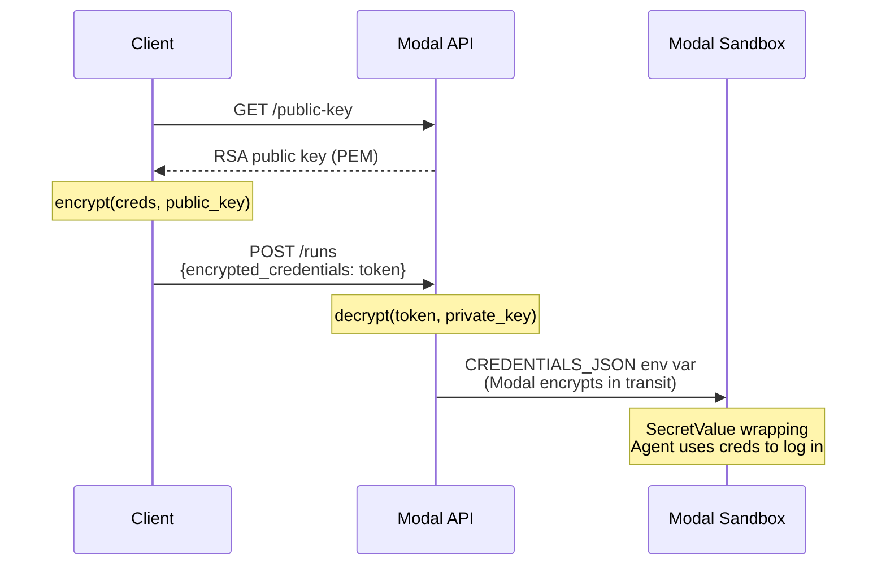
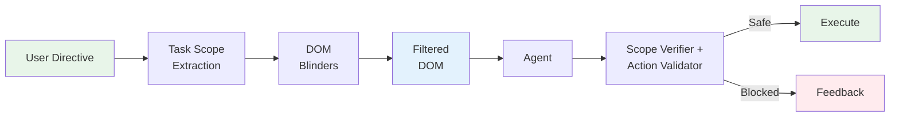

# CUA — Computer Use Agent

LLM-powered browser automation. CUA is built for **internal dashboard operations** — the kind of tasks that live behind a login, lack API coverage, and require clicking through UI flows manually. Define known workflows as deterministic YAML playbooks; for everything else, the LLM agent drives the browser autonomously.

While optimized for internal tooling (session persistence, private network access, auth handling), CUA works as a general-purpose browser agent for any web-based task.

**Playbook-first architecture**: known workflows run deterministically via Playwright with zero LLM calls. If a step breaks (UI changed, selector stale), CUA hands off all remaining steps to the full LLM agent to finish the job.

```text
Directive → Playbook Lookup → PlaybookRunner (deterministic) → Result
                 ↓ (miss)              ↓ (step fails 2x)
            Full LLM Agent    LLM Agent completes remaining steps
```

## Model Configuration

CUA uses [PydanticAI](https://ai.pydantic.dev/) and works with any model it supports — Anthropic, OpenAI, Google Gemini, Groq, and more. Set the model in `settings.py`:

```python
PRIMARY_MODEL = "google-gla:gemini-3-flash-preview"      # main agent
UTILITY_MODEL = "google-gla:gemini-3.1-flash-lite-preview"  # classification, guardrails, extraction
```

To switch providers, change the model string and set the corresponding API key as an environment variable:

```bash
# Anthropic
export ANTHROPIC_API_KEY=sk-ant-...

# OpenAI
export OPENAI_API_KEY=sk-...

# Google Gemini
export GOOGLE_API_KEY=...
```

PydanticAI reads these automatically — no code changes needed. See [PydanticAI models documentation](https://ai.pydantic.dev/models/) for the full list of supported providers and model string formats.

**Recommended models for `PRIMARY_MODEL`:**

| Model | Thinking | Notes |
|---|---|---|
| `google-gla:gemini-3-flash-preview` | >= `high` | Fastest response times. Sonnet or GPT-5.4 have better precision for complex selectors. |
| `anthropic:claude-sonnet-4-6` | >= `medium` | Strong selector accuracy and DOM reasoning. |
| `openai-responses:gpt-5.4` | >= `medium` | Strong quality. Must use `openai-responses:` prefix (not `openai:`) for thinking + tools support. |

The agent relies on accurate CSS selector generation from DOM snapshots — weaker models produce selectors that timeout or miss elements.

For `UTILITY_MODEL` (classification, guardrails), a fast/cheap model like `anthropic:claude-haiku-4-5` or `openai:gpt-5.4-mini` works well.

## Development

### Install

```bash
uv sync --dev
patchright install chromium
```

Python `3.13+` is required.

### Tests

The default test suite is fully offline:

- no real LLM calls
- no API keys required
- browser integration tests are opt-in

Run the default suite:

```bash
pytest -q
```

Run browser integration tests explicitly:

```bash
pytest -q -m integration
```

### Evaluation

Local eval suites let you measure task success, action count, latency, and output quality on representative flows.

For agent cases, prefer setting an explicit `output_schema` in the suite. That keeps the structured result shape stable and makes assertions on `data` deterministic enough to be useful.

Run the example suite:

```bash
python scripts/eval_local.py --suite evaluation/suites/example.yaml
```

This writes a JSON report to `output/evals/report.json` by default, alongside per-run artifacts for each case.

## Quick Start

### Playbook execution (deterministic, no LLM loop)

```bash
pip install -e ".[dev]" && patchright install chromium
Xvfb :99 -screen 0 1280x720x24 &  # Linux only

python scripts/run_local.py \
  --directive "Cancel order #12345" \
  --playbook cancel_order \
  --playbook-params '{"order_id": "12345"}' \
  --credentials '{"username": "admin", "password": "secret"}'
```

### LLM agent fallback (for unknown flows)

```bash
python scripts/run_local.py \
  --directive "Go to http://dashboard.internal/orders and find the latest order" \
  --allow-private-networks \
  --credentials '{"username": "admin", "password": "secret"}'
```

### Deploy to Modal

CUA deploys to [Modal](https://modal.com) as a managed API. Each run spawns an isolated sandbox with its own browser, desktop environment, and agent runtime.

**1. Install Modal and authenticate:**

```bash
pip install modal
modal setup
```

**2. Create a secret with your API keys:**

```bash
# Generate encryption key (one-time)
openssl genrsa -out private.pem 4096

modal secret create llm-secret \
  ANTHROPIC_API_KEY=sk-ant-... \
  OPENAI_API_KEY=sk-... \
  GOOGLE_API_KEY=... \
  CUA_API_KEY=your-secret-api-key \
  CUA_PRIVATE_KEY_PEM="$(cat private.pem)" \
  ENVIRONMENT=production
```

Set at least one LLM provider key. `CUA_API_KEY` is the Bearer token clients use to authenticate — pick any strong secret. `CUA_PRIVATE_KEY_PEM` enables credential encryption (see [Credential Security](#credential-security)). `ENVIRONMENT=production` enables auth enforcement.

**3. Deploy:**

```bash
modal deploy api/server.py::modal_app
```

The first deploy builds the sandbox image (~5 min for apt packages + Chromium). Subsequent deploys reuse the cached image and take ~30s.

**4. Use the API:**

```bash
# Create a run
curl -X POST https://<workspace>--cua-serve.modal.run/runs \
  -H "Content-Type: application/json" \
  -H "Authorization: Bearer your-secret-api-key" \
  -d '{"directive": "Go to example.com and tell me the page title"}'

# Check status
curl https://<workspace>--cua-serve.modal.run/runs/{run_id} \
  -H "Authorization: Bearer your-secret-api-key"

# Stream events (SSE)
curl -N https://<workspace>--cua-serve.modal.run/runs/{run_id}/stream \
  -H "Authorization: Bearer your-secret-api-key"

# Stop a run
curl -X POST https://<workspace>--cua-serve.modal.run/runs/{run_id}/stop \
  -H "Authorization: Bearer your-secret-api-key"
```

Replace `<workspace>` with your Modal workspace name (shown after `modal deploy`).

**API request body (`POST /runs`):**

| Field | Type | Default | Description |
|---|---|---|---|
| `directive` | string | (required) | Natural language task |
| `model` | string | `google-gla:gemini-3-flash-preview` | LLM model |
| `max_steps` | int | 50 | Max agent iterations |
| `timeout_seconds` | int | 600 | Sandbox timeout (30-3600) |
| `thinking` | string | `high` | Thinking effort level |
| `start_url` | string | null | URL to open on launch |
| `credentials` | object | null | `{"domain": {"username": "...", "password": "..."}}` (plaintext, for local dev) |
| `encrypted_credentials` | string | null | Token from `encrypt_credentials()` (recommended for production) |
| `profile` | string | `default` | Agent profile |
| `guardrails` | object | null | Domain/action safety config |
| `recording` | object | null | `{"enabled": true, "screenshots": true, "trace": true}` |

## Tools

CUA exposes a single `browser_dom` tool with 9 actions. The agent chooses which action to call based on the task and page state.

| Action | Description | Returns |
|---|---|---|
| `goto(url)` | Navigate to a URL | DOM snapshot |
| `click(selector)` | Click an element (CSS, `text=`, `role=` selectors) | DOM snapshot |
| `screenshot` | Capture the viewport | Screenshot + DOM |
| `key_press(text, key)` | Type text and/or press a key (Enter, Tab, etc.) | Confirmation |
| `scroll(direction, amount)` | Scroll the page | Screenshot |
| `extract(selector, mode)` | Extract text, HTML, or form values from elements | Content string |
| `get_dom(selector?)` | Get a compact DOM snapshot (optionally scoped) | DOM string |
| `wait_for(selector, state)` | Wait for an element to be visible, hidden, etc. | Confirmation |
| `execute_sequence(steps)` | **Batch multiple actions in a single tool call** | Combined results + DOM |

### Why `execute_sequence` matters

Each tool call has ~3-5s of overhead (API round-trip + thinking). Without batching, filling a 5-field form takes 5 separate calls = ~20s of pure overhead. With `execute_sequence`, it's a single call:

```json
{
  "action": "execute_sequence",
  "steps": [
    {"action": "click", "selector": "#email"},
    {"action": "key_press", "text": "user@example.com"},
    {"action": "click", "selector": "#password"},
    {"action": "key_press", "text": "secretpass"},
    {"action": "click", "selector": "button[type=submit]"}
  ]
}
```

Intermediate steps skip screenshots for speed. Only the final step captures the DOM, so the agent sees the result of the entire sequence in one response.

### Design choices

- **DOM-first, not screenshot-first.** `goto` and `click` return a compact DOM snapshot (~200-500 tokens) instead of a screenshot (~1-2K image tokens). The agent only takes screenshots when it needs to *see* the page visually.
- **Streaming execution.** Tool calls execute as they arrive from the Claude API stream, not after the full response.
- **Adaptive thinking budget.** Full budget for planning (first 2 steps), reduced after 3+ consecutive successes, reset on errors.
- **Aggressive context pruning.** Old screenshots, DOM snapshots, and thinking blocks are stripped every iteration. Input tokens stay flat regardless of run length.
- **Page-change detection.** After `goto`/`click`/`execute_sequence`, remaining tool calls in the same response are skipped — they were planned on stale state.
- **CAPTCHA auto-resolution.** Patchright stealth patches + auto-wait up to 30s for Cloudflare/reCAPTCHA/hCaptcha.
- **Stuck detection.** System hint after 4+ of the last 6 actions produce identical results.

## Playbook System

Playbooks define deterministic action sequences for known dashboard workflows. Each step has a selector fallback chain and post-action verification.

### Creating a playbook from a recording

Instead of writing YAML by hand, use the `/create-playbook` Claude Code skill to record a browser session and generate a playbook automatically:

1. Run `/create-playbook` in Claude Code
2. Provide a directive (e.g., "Cancel order #12345") and the dashboard URL
3. A browser window opens — perform the workflow manually
4. Close the browser or press Ctrl+Shift+S when done
5. Claude reads the recorded interactions and generates an optimized playbook with selector fallback chains, verification steps, and parameterized values

The recording captures clicks, typing, navigation, and selections, then generates multiple selector candidates per element (role, text, attribute, structural) for resilience against UI changes.

You can also record standalone without the skill:

```bash
python scripts/record_interaction.py \
  --start-url https://dashboard.internal/orders \
  --output output/recording.json
```

### Defining a playbook manually

You can also write playbooks by hand. See the examples in `playbooks/definitions/` for the full YAML schema — each file demonstrates steps, selector fallback chains, parameter injection, and verification.

### Available actions

Playbooks support these actions (same as the LLM agent's `browser_dom` tool):

| Action | Description | Playbook-specific notes |
|---|---|---|
| `goto(url)` | Navigate to a URL | Supports `{param}` placeholders in URL |
| `click(selector)` | Click an element | Uses selector fallback chain |
| `key_press(text, key)` | Type text and/or press a key | `text` supports `{param}` placeholders; if selector provided, uses `page.fill()` |
| `scroll(direction, amount)` | Scroll the page | Direction: up/down/left/right |
| `wait_for(selector, state)` | Wait for element state | Comma-separated selectors supported |
| `extract(selector, mode)` | Extract text, HTML, or form values | Modes: `text` (default), `html`, `value`. Output shown in results |
| `select(selector, value)` | Select a dropdown option | Uses selector fallback chain |

### Playbook features

- **Selector fallback chains**: Each step tries `primary` selector first, then `fallbacks` in order (800ms timeout per selector). Handles dashboard UI changes without playbook edits.
- **Step verification**: Assert expected state after every action — `expect_url_contains`, `expect_element_visible`, `expect_element_gone`, `expect_text_on_page`. Catches failures immediately.
- **Parameter injection**: `{param_name}` placeholders in selectors, params, descriptions, and verification are replaced at runtime.
- **Step outputs**: `extract` steps can set `store_as` and later steps can reference `{stored_value}` in URLs, selectors, and verification without custom JavaScript.
- **Data extraction**: `extract` steps capture text from elements and display it in the output.
- **Declarative navigation**: Prefer `extract` + `store_as` + `goto` over raw JavaScript for FK traversal and similar flows.
- **Per-playbook guardrails**: Each playbook can specify its own `guardrails` config (private networks, LLM checks, URL limits). Used both during playbook execution and when falling back to the LLM agent.
- **Failure handling**: Each step can specify `on_failure`:
  - `llm_recover` (default) — after 2 failures, hands off ALL remaining steps to the full LLM agent
  - `retry` — retry without LLM fallback
  - `abort` — stop immediately
- **Authentication**: Built-in login flow with session persistence via Playwright cookies/localStorage. Sessions saved to `~/.cua/sessions/` and reused across runs.

### Execution tiers

| Tier | When | LLM Calls | Latency |
|------|------|-----------|---------|
| Playbook hit | Known flow, selectors match | 0 | 1-5s |
| Playbook + LLM handoff | Known flow, page changed | 5-15 | 15-30s |
| Full LLM agent | No playbook, unknown flow | 5-15 | 30-60s |

### LLM handoff on failure

When a playbook step fails twice, CUA doesn't try to patch individual steps — the page state has likely diverged from what the playbook expects. Instead, it hands off the **entire remaining task** to the full LLM agent with:
- The playbook's name, description, and guardrails config
- What failed and the current page URL
- Descriptions of ALL remaining steps

The LLM agent takes full browser control and drives to completion, just like a normal CUA run but with a focused directive.

## Authentication

CUA handles dashboard login with session persistence:

```bash
python scripts/run_local.py \
  --directive "..." \
  --playbook my_flow \
  --credentials '{"email": "admin@company.com", "password": "secret"}'
```

The auth system:
1. Tries restoring a previously saved session (cookies/localStorage)
2. If expired, logs in by detecting common form patterns (email/username + password fields)
3. Saves the new session for future runs

Sessions are stored at `~/.cua/sessions/` and reused across runs.

## Credential Security

CUA uses hybrid RSA + AES-256-GCM encryption to protect credentials in transit. Clients encrypt credentials with the server's public key before sending; the server decrypts with its private key. Credentials are wrapped in `SecretValue` in memory, which masks them in logs, `repr()`, and prevents accidental JSON serialization.

### Setup (Modal deployment)

**1. Generate an RSA key pair:**

```bash
openssl genrsa -out private.pem 4096
```

**2. Add the private key to your Modal secret:**

```bash
modal secret create llm-secret \
  ANTHROPIC_API_KEY=sk-ant-... \
  OPENAI_API_KEY=sk-... \
  GOOGLE_API_KEY=... \
  CUA_API_KEY=your-secret-api-key \
  CUA_PRIVATE_KEY_PEM="$(cat private.pem)" \
  ENVIRONMENT=production
```

**3. Deploy as usual:**

```bash
modal deploy api/server.py::modal_app
```

### Client usage

**Step 1 — Fetch the server's public key:**

```bash
curl https://<workspace>--cua-serve.modal.run/public-key \
  -H "Authorization: Bearer your-secret-api-key" \
  -o public_key.pem
```

Cache this key — it only changes if you rotate the private key.

**Step 2 — Encrypt credentials and send:**

```python
from credentials import encrypt_credentials

# Load the server's public key
with open("public_key.pem", "rb") as f:
    public_key = f.read()

# Encrypt credentials
token = encrypt_credentials(
    {"github": {"username": "bot", "password": "ghp_abc123"}},
    public_key,
)

# Send the encrypted token (not the raw credentials)
import httpx
resp = httpx.post(
    "https://<workspace>--cua-serve.modal.run/runs",
    headers={"Authorization": "Bearer your-secret-api-key"},
    json={
        "directive": "Log into GitHub and check notifications",
        "encrypted_credentials": token,
    },
)
```

You can also pass unencrypted `credentials` directly — this is useful for local development where both client and server are on the same machine:

```bash
python scripts/run_local.py \
  --directive "Log into the admin panel" \
  --credentials '{"admin": {"username": "admin", "password": "secret"}}'
```

### How it works



**Security properties:**
- Raw credentials never appear in API request bodies (only the encrypted token)
- `SecretValue` wrapper masks credentials in logs, `str()`, `repr()`, and blocks `json.dumps()`
- Private key stays in Modal's encrypted secret store, never leaves the server
- AES-256-GCM provides authenticated encryption (tampered tokens are rejected)
- Public key can be freely distributed — it can only encrypt, not decrypt

### Key rotation

To rotate the encryption key:

1. Generate a new key pair: `openssl genrsa -out private_new.pem 4096`
2. Update the Modal secret: `modal secret create llm-secret ... CUA_PRIVATE_KEY_PEM="$(cat private_new.pem)"`
3. Redeploy: `modal deploy api/server.py::modal_app`
4. Clients fetch the new public key from `GET /public-key`

Tokens encrypted with the old key will fail to decrypt — clients must re-encrypt with the new public key.

## Guardrails

CUA uses a layered safety architecture combining proactive observation control with runtime checks. Playbook execution bypasses most of these (pre-approved flows), but the LLM fallback path enforces all layers.

### Cognitive Blinders

The primary safety mechanism is **Cognitive Blinders** — a proactive observation filtering system that controls what the agent can see, rather than reactively blocking what it tries to do.

**The core insight**: if the agent can't see a "delete account" button, it can't click it. If it can't see injected instructions in a sidebar ad, it can't follow them.



**How it works:**

**1. Task Scope Extraction** — Before the agent sees any web content, the directive is classified into a goal type that determines what the agent can see and do.

| Goal Type | Forms | Dangerous Buttons | Account Controls | `key_press` | `execute_sequence` |
|---|---|---|---|---|---|
| `read` | Hidden | Hidden | Hidden | Blocked | Blocked |
| `navigate` | Hidden | Hidden | Hidden | Blocked | Blocked |
| `interact` | Visible | Visible | Hidden | Allowed | Allowed |
| `fill_form` | Visible | Visible | Visible | Allowed | Allowed |

**2. DOM Blinders** — The DOM snapshot sent to the agent is filtered at two levels:

| Level | Where | What it does |
|---|---|---|
| **JS-side** | `dom_snapshot.js` in browser | Filters elements by category (forms, action buttons, account controls) based on task scope. Elements are removed before they leave the browser. |
| **Python-side** | `blinders/filters.py` | Scans for prompt injection patterns (`"ignore previous instructions"`, `SYSTEM:`, `[INST]` tokens) and redacts them. Wraps content with provenance markers (`[web-content-start/end]`). |

**3. Scope Verifier + Action Validator** — Multi-layer pre-execution check:

| Layer | Speed | What it checks |
|---|---|---|
| **Deterministic** | ~25us | Action type allowed for goal? Domain in scope? SSRF? Navigation limit? |
| **Regex fast-path** | ~5us | Is this a known-safe selector (navigation, menus, filters)? |
| **Action Validator (Haiku)** | ~500ms | Is this action aligned with the user's task? Should a potentially destructive click proceed? (LLM fallback path only) |

**4. Tool Schema Restriction** — The tool definition sent to Claude only includes actions allowed by the task scope. For a `read` task, `key_press` and `execute_sequence` are absent from the schema — the model cannot select them.

### Runtime Guardrails

Defense-in-depth checks that run alongside Cognitive Blinders. Configurable per-playbook via the `guardrails` section in YAML:

| Guard | Default | Configurable |
|---|---|---|
| Domain blocklist | Banking, government, email, payment, social media | `allowed_domains` / `blocked_domains` |
| Destructive action handling | Task-alignment and click safety are decided in the LLM validation path when enabled; deterministic scope/domain checks still apply regardless | `enable_llm_action_check` |
| SSRF protection | Private IPs blocked (override per-playbook) | `allow_private_networks` |
| URL visit limit | 50 unique URLs per run | `max_urls_visited` |
| Consecutive error limit | 5 errors | `max_consecutive_errors` |
| CAPTCHA handling | Auto-detect + type-specific timeouts (Cloudflare 30s, reCAPTCHA 5s) | Skipped for dashboard goal type |

Notes:

- The default offline test suite does not make live LLM calls; it exercises degraded and deterministic paths only.
- In real agent runs, `enable_llm_action_check=true` lets the model decide whether an ambiguous click is aligned with the task.
- Playbook execution remains deterministic; the LLM safety path is relevant for ad hoc agent runs and LLM handoff flows.

## Session Recording & Replay

Every CUA session is recorded by default using Playwright's built-in tracing. After a run completes, you get a `trace.zip` that you can open in [Playwright Trace Viewer](https://trace.playwright.dev) for frame-by-frame session replay with DOM snapshots, screenshots, network requests, and console logs at each action.

### Local runs

Recordings are saved to the `output/` directory:

```bash
python scripts/run_local.py --directive "Cancel order #123" --playbook cancel_order
# After completion:
# output/trace.zip         — Playwright trace (open in trace viewer)
# output/screenshots/      — per-action JPEGs
# output/action_log.json   — structured action log (LLM path only)
```

Replay the session:

```bash
npx playwright show-trace output/trace.zip
```

Or drag `trace.zip` into [trace.playwright.dev](https://trace.playwright.dev) in your browser.

### Modal runs

Recordings are persisted to a Modal Volume (`cua-recordings`) and accessible via the API:

```bash
# List recording artifacts
curl https://<workspace>--cua-serve.modal.run/runs/{run_id}/recording/manifest \
  -H "Authorization: Bearer your-secret-api-key"

# Download the trace
curl -o trace.zip https://<workspace>--cua-serve.modal.run/runs/{run_id}/recording/trace \
  -H "Authorization: Bearer your-secret-api-key"

# Download a specific screenshot
curl -o shot.jpg https://<workspace>--cua-serve.modal.run/runs/{run_id}/recording/screenshots/0003_click.jpg \
  -H "Authorization: Bearer your-secret-api-key"
```

## Observability

CUA includes built-in OpenTelemetry instrumentation for distributed tracing, metrics, and structured logging.

### Traces

Every session produces a single trace linking the outer API request to every agent step inside the sandbox:

```text
cua.session                          -> API request lifecycle
  cua.sandbox.create                 -> Modal sandbox creation
  cua.agent.run                      -> Full agent run
    cua.agent.setup                  -> Browser launch + blinders init
    cua.agent.iteration [xN]         -> One per loop iteration
      cua.llm.call                   -> Claude API call
      cua.tool.execute [xM]          -> Each browser action
        cua.guardrail.check          -> Safety verification
        cua.browser.action           -> Patchright execution
    cua.recording.start              -> Recording initialization
    cua.recording.stop               -> Recording finalization
```

Spans include GenAI semantic convention attributes (`gen_ai.usage.input_tokens`, `gen_ai.usage.output_tokens`), action details, guardrail decisions, and timing.

### Telemetry configuration

| Env Var | Default | Description |
|---|---|---|
| `OTEL_SDK_DISABLED` | `true` | Set to `false` to enable tracing and metrics |
| `OTEL_EXPORTER_OTLP_ENDPOINT` | `http://localhost:4317` | OTLP gRPC collector endpoint |
| `OTEL_EXPORTER_OTLP_INSECURE` | `false` | Set to `true` for insecure local collector |
| `OTEL_RESOURCE_ENV` | `local` | Deployment environment label |
| `OTEL_TRACES_SAMPLER_ARG` | `1.0` | Sampling rate (0.0-1.0) |

Quick start with Jaeger:

```bash
docker run -d --name jaeger -p 16686:16686 -p 4317:4317 jaegertracing/all-in-one
OTEL_SDK_DISABLED=false python scripts/run_local.py --directive "..."
# Open http://localhost:16686 to see traces
```

## Configuration

### CLI parameters

| Parameter | Default | Description |
|---|---|---|
| `--directive` | (required) | Natural language task description |
| `--playbook` | None | Playbook ID to execute deterministically |
| `--playbook-params` | None | JSON dict of playbook parameters |
| `--credentials` | None | JSON dict with `username`/`email` and `password` |
| `--model` | `anthropic:claude-sonnet-4-6` | Model for LLM agent (any PydanticAI-supported model) |
| `--max-steps` | 50 | Max tool-call iterations (LLM path only) |
| `--thinking` | `high` | Thinking effort level (`minimal`, `low`, `medium`, `high`, `xhigh`) |
| `--allow-private-networks` | false | Allow localhost and private IPs |
| `--start-url` | None | URL to open on browser launch |
| `--display` | `:99` | X display (Linux) |

### Playbook guardrails config

Set per-playbook in the YAML `guardrails` section:

```yaml
guardrails:
  allow_private_networks: true          # Allow localhost/internal IPs
  enable_llm_action_check: false        # Skip Haiku safety check for pre-approved flows
  max_urls_visited: 200                 # URL navigation limit
  max_consecutive_errors: 10            # Error limit before aborting
  allowed_domains: ["*.internal.com"]   # Domain allowlist (optional)
```

When omitted, safe defaults apply (private networks blocked, LLM checks enabled, standard limits).

## Project Structure

```text
cua/
├── playbooks/       Playbook system (schema, store, runner, parser, auth)
│   └── definitions/ YAML playbook files
├── agent/           LLM agent loop (fallback path)
├── blinders/        Cognitive Blinders (scope, DOM filters, verifier)
├── bridge/          Browser lifecycle, DOM execution, CAPTCHA handling, router
├── api/             FastAPI server, API models, run registry
├── guardrails/      Domain/action/SSRF safety engine
├── recording/       Session recording (Playwright tracing + screenshots)
├── profiles/        Agent profile configuration
├── telemetry/       OpenTelemetry instrumentation
├── scripts/         Local dev runner
├── tests/           Unit + integration tests
└── config.py        Centralized configuration
```

## License

MIT — see [LICENSE](LICENSE).
