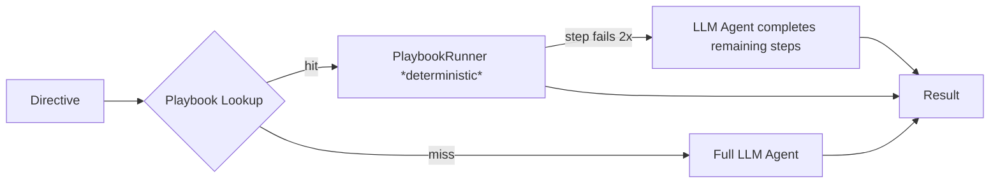
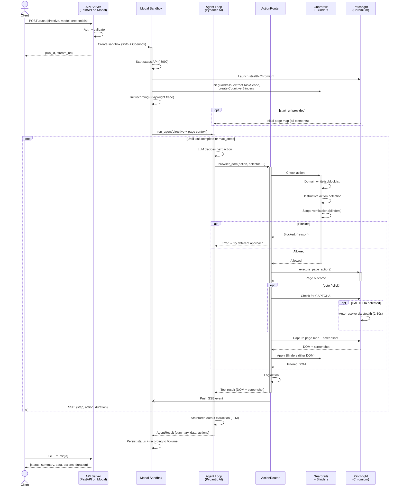

# CUA — Computer Use Agent

LLM-powered browser automation for **internal dashboard operations** — tasks behind a login that lack API coverage and require clicking through UI flows manually.

**Playbook-first architecture**: known workflows run deterministically via Playwright with zero LLM calls. If a step breaks (UI changed, selector stale), CUA hands off to the full LLM agent to finish the job.



## Why CUA

- **Playbook + LLM hybrid** — deterministic YAML playbooks for known flows (0 LLM calls, 1-5s), automatic LLM fallback for unknown flows or broken selectors
- **Semantic page understanding** — unlike screenshot-based agents that "look" at pixels or raw DOM dumpers that flood the context window, CUA builds a structured page map with semantic landmarks (region summaries like `form#login: 3 inputs, 1 button` and `table#results: 5 cols, 47 rows`), parent-context disambiguation (`Edit [row: "john@example.com"]`), and action-outcome verification (`[URL changed → /dashboard]`). The agent understands page structure, not just elements — and every action confirms whether it worked
- **Multi-provider** — works with Anthropic, OpenAI, Google Gemini, and any [PydanticAI-supported model](https://ai.pydantic.dev/models/)
- **Safety by default** — Cognitive Blinders filter what the agent can see based on task type, preventing prompt injection and accidental destructive actions
- **Real-time streaming** — SSE event stream with full replay, `Last-Event-ID` reconnection, and post-completion persistence
- **Production-ready** — deploys to Modal with isolated sandboxes, multi-container support, session recording, and OpenTelemetry observability

## Architecture



## Quick Start

### Install

```bash
uv sync --dev
patchright install chromium
```

Requires Python `3.13+`.

### Run Locally

```bash
# Deterministic playbook (no LLM)
python scripts/run_local.py \
  --directive "Cancel order #12345" \
  --playbook cancel_order \
  --playbook-params '{"order_id": "12345"}' \
  --credentials '{"username": "admin", "password": "secret"}'

# LLM agent (for unknown flows)
python scripts/run_local.py \
  --directive "Go to the dashboard, log in with the provided credentials, and find the latest order" \
  --credentials '{"username": "admin", "password": "secret"}'
```

Credentials are resolved at fill time — secrets should not appear in the LLM prompt or action logs (see [Authentication](docs/authentication.md) for caveats).

For deterministic workflows without LLM calls, see [Playbooks](docs/playbooks.md).

### Deploy to Modal

```bash
pip install modal && modal setup

# Create secrets
modal secret create cua-secret \
  GOOGLE_API_KEY=... \
  CUA_API_KEY=your-secret-api-key \
  ENVIRONMENT=production

# Deploy
modal deploy api/server.py::modal_app
```

### Use the API

```bash
# Create a run
curl -X POST https://<workspace>--cua-serve.modal.run/runs \
  -H "Content-Type: application/json" \
  -H "Authorization: Bearer your-secret-api-key" \
  -d '{"directive": "Go to example.com and tell me the page title"}'
```

See [API Reference](docs/api.md) for status polling, SSE streaming, and stop endpoints.

## Tests

```bash
pytest -q                    # offline unit tests (no API keys needed)
pytest -q -m integration     # browser integration tests
```

## Project Structure

```text
cua/
├── playbooks/       Playbook system (schema, store, runner, parser, auth)
│   └── definitions/ YAML playbook files
├── agent/           LLM agent loop (fallback path)
│   └── session/     Sandbox session runner + finalization
├── actionlog/       Action logging and persistence
├── blinders/        Cognitive Blinders (scope, DOM filters, verifier)
├── bridge/          Browser lifecycle, DOM execution, CAPTCHA handling, router
├── api/             FastAPI server, API models, recording, sandbox streaming
│   └── runs/        Run service, registry, and persisted status store
├── evaluation/      Local evaluation suites, scoring, and benchmark runner
├── guardrails/      Domain/action/SSRF safety engine
├── recording/       Session recording (Playwright tracing)
├── sandbox/         Modal sandbox image and entrypoint
├── profiles/        Agent profile configuration
├── telemetry/       OpenTelemetry instrumentation
├── scripts/         Local dev runner
├── tests/           Unit + integration tests
├── docs/            Detailed documentation
├── config.py        Centralized runtime configuration
└── settings.py      Environment settings (model constants, timeouts)
```

## Documentation

| Topic | Description |
|---|---|
| [Architecture](docs/architecture.md) | Full sequence diagram and component overview |
| [API Reference](docs/api.md) | Endpoints, SSE streaming, replay, multi-container support |
| [Browser Tools](docs/tools.md) | 9 browser actions, `execute_sequence` batching, design choices |
| [Playbooks](docs/playbooks.md) | Deterministic workflows, selector fallbacks, LLM handoff |
| [Authentication](docs/authentication.md) | Session persistence, credential refs, `SecretValue`, and security caveats |
| [Guardrails](docs/guardrails.md) | Cognitive Blinders, runtime safety, domain/action controls |
| [Recording](docs/recording.md) | Playwright tracing, session replay |
| [Evaluation](docs/evaluation.md) | Benchmark suites, trial scoring, pass/fail expectations |
| [Observability](docs/observability.md) | OpenTelemetry traces, metrics, Jaeger setup |
| [Configuration](docs/configuration.md) | CLI parameters, model selection, provider setup |

## License

MIT — see [LICENSE](LICENSE).
