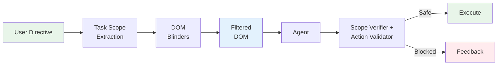

# CUA — Computer Use Agent for Internal Dashboard Automation

Deterministic browser automation for internal dashboards, powered by Claude. CUA automates actions that can only be performed through a dashboard UI — replacing manual work when building external API endpoints is impractical due to linked business logic and side effects.

CUA uses a **playbook-first architecture**: define workflows as YAML playbooks with selector fallback chains and step verification, then execute them deterministically via Playwright. When a playbook step fails twice, CUA hands off **all remaining steps** to the full LLM agent, which takes complete control of the browser to finish the task.

```
Directive → Playbook Lookup → PlaybookRunner (deterministic) → Result
                 ↓ (miss)              ↓ (step fails 2x)
            Full LLM Agent    LLM Agent completes remaining steps
```

## Quick Start

### Playbook execution (deterministic, no LLM loop)

```bash
pip install -e ".[dev]" && patchright install chromium
Xvfb :99 -screen 0 1280x720x24 &  # Linux only

python scripts/run_local.py \
  --directive "Cancel order #12345" \
  --playbook cancel_order \
  --playbook-params '{"order_id": "12345"}' \
  --credentials '{"username": "admin", "password": "secret"}'
```

### LLM agent fallback (for unknown flows)

```bash
python scripts/run_local.py \
  --directive "Go to http://dashboard.internal/orders and find the latest order" \
  --allow-private-networks \
  --credentials '{"username": "admin", "password": "secret"}'
```

### API deployment

```bash
modal secret create anthropic-secret ANTHROPIC_API_KEY=sk-ant-...
modal deploy api/server.py

curl -X POST https://your-app--cua.modal.run/runs \
  -H "Content-Type: application/json" \
  -H "Authorization: Bearer $CUA_API_KEY" \
  -d '{"directive": "Cancel order #12345"}'
```

## Playbook System

Playbooks define deterministic action sequences for known dashboard workflows. Each step has a selector fallback chain and post-action verification.

### Defining a playbook

Create a YAML file in `playbooks/definitions/`:

```yaml
id: cancel_order
name: Cancel Order
description: Find order by ID and cancel it
tags: ["cancel", "cancel order"]
auth_required: true
guardrails:
  allow_private_networks: true       # for localhost dashboards
  enable_llm_action_check: false     # pre-approved flows
  max_urls_visited: 200
  max_consecutive_errors: 10
parameters:
  - name: order_id
    type: string
    description: The order ID to cancel
    pattern: "#?(\\d{3,})"

steps:
  - action: goto
    params:
      url: "https://dashboard.internal/orders"
    verify:
      expect_url_contains: "/orders"
      expect_element_visible: "table"
    description: Navigate to orders page

  - action: click
    selector:
      primary: "input[placeholder*='Search']"
      fallbacks:
        - "role=searchbox"
        - "input[type='search']"
    description: Click search box

  - action: key_press
    params:
      text: "{order_id}"
    description: Type order ID

  - action: key_press
    params:
      key: Enter
    verify:
      expect_element_visible: "table tbody tr"
    description: Submit search

  - action: click
    selector:
      primary: "text=Cancel"
      fallbacks:
        - "button.cancel-btn"
        - "role=button[name*='Cancel']"
    verify:
      expect_element_visible: "text=Are you sure"
    description: Click cancel button

  - action: click
    selector:
      primary: "text=Confirm"
      fallbacks:
        - "button.confirm-btn"
        - ".modal button.primary"
    verify:
      expect_text_on_page: "cancelled"
    description: Confirm cancellation
```

### Available actions

Playbooks support these actions (same as the LLM agent's `browser_dom` tool):

| Action | Description | Playbook-specific notes |
|---|---|---|
| `goto(url)` | Navigate to a URL | Supports `{param}` placeholders in URL |
| `click(selector)` | Click an element | Uses selector fallback chain |
| `key_press(text, key)` | Type text and/or press a key | `text` supports `{param}` placeholders; if selector provided, uses `page.fill()` |
| `scroll(direction, amount)` | Scroll the page | Direction: up/down/left/right |
| `wait_for(selector, state)` | Wait for element state | Comma-separated selectors supported |
| `extract(selector, mode)` | Extract text, HTML, or form values | Modes: `text` (default), `html`, `value`. Output shown in results |
| `evaluate(script)` | Execute JavaScript on the page | For reading DOM values, navigating via JS |
| `select(selector, value)` | Select a dropdown option | Uses selector fallback chain |

### Playbook features

- **Selector fallback chains**: Each step tries `primary` selector first, then `fallbacks` in order (800ms timeout per selector). Handles dashboard UI changes without playbook edits.
- **Step verification**: Assert expected state after every action — `expect_url_contains`, `expect_element_visible`, `expect_element_gone`, `expect_text_on_page`. Catches failures immediately.
- **Parameter injection**: `{param_name}` placeholders in selectors, params, descriptions, and verification are replaced at runtime.
- **Data extraction**: `extract` steps capture text from elements and display it in the output.
- **JavaScript evaluation**: `evaluate` steps run arbitrary JS for complex DOM interactions (e.g., reading FK select values and navigating to detail pages).
- **Per-playbook guardrails**: Each playbook can specify its own `guardrails` config (private networks, LLM checks, URL limits). Used both during playbook execution and when falling back to the LLM agent.
- **Failure handling**: Each step can specify `on_failure`:
  - `llm_recover` (default) — after 2 failures, hands off ALL remaining steps to the full LLM agent
  - `retry` — retry without LLM fallback
  - `abort` — stop immediately
- **Authentication**: Built-in login flow with session persistence via Playwright cookies/localStorage. Sessions saved to `~/.cua/sessions/` and reused across runs.

### Execution tiers

| Tier | When | LLM Calls | Latency |
|------|------|-----------|---------|
| Playbook hit | Known flow, selectors match | 0 | 1-5s |
| Playbook + LLM handoff | Known flow, page changed | 5-15 | 15-30s |
| Full LLM agent | No playbook, unknown flow | 5-15 | 30-60s |

### LLM handoff on failure

When a playbook step fails twice, CUA doesn't try to patch individual steps — the page state has likely diverged from what the playbook expects. Instead, it hands off the **entire remaining task** to the full LLM agent with:
- The playbook's name, description, and guardrails config
- What failed and the current page URL
- Descriptions of ALL remaining steps

The LLM agent takes full browser control and drives to completion, just like a normal CUA run but with a focused directive.

## Authentication

CUA handles dashboard login with session persistence:

```bash
python scripts/run_local.py \
  --directive "..." \
  --playbook my_flow \
  --credentials '{"email": "admin@company.com", "password": "secret"}'
```

The auth system:
1. Tries restoring a previously saved session (cookies/localStorage)
2. If expired, logs in by detecting common form patterns (email/username + password fields)
3. Saves the new session for future runs

Sessions are stored at `~/.cua/sessions/` and reused across runs.

## Guardrails

CUA uses a layered safety architecture combining proactive observation control with runtime checks. Playbook execution bypasses most of these (pre-approved flows), but the LLM fallback path enforces all layers.

### Cognitive Blinders

The primary safety mechanism is **Cognitive Blinders** — a proactive observation filtering system that controls what the agent can see, rather than reactively blocking what it tries to do.

**The core insight**: if the agent can't see a "delete account" button, it can't click it. If it can't see injected instructions in a sidebar ad, it can't follow them.



**How it works:**

**1. Task Scope Extraction** — Before the agent sees any web content, the directive is classified into a goal type that determines what the agent can see and do.

| Goal Type | Forms | Dangerous Buttons | Account Controls | `key_press` | `execute_sequence` |
|---|---|---|---|---|---|
| `read` | Hidden | Hidden | Hidden | Blocked | Blocked |
| `navigate` | Hidden | Hidden | Hidden | Blocked | Blocked |
| `interact` | Visible | Visible | Hidden | Allowed | Allowed |
| `fill_form` | Visible | Visible | Visible | Allowed | Allowed |

**2. DOM Blinders** — The DOM snapshot sent to the agent is filtered at two levels:

| Level | Where | What it does |
|---|---|---|
| **JS-side** | `dom_snapshot.js` in browser | Filters elements by category (forms, action buttons, account controls) based on task scope. Elements are removed before they leave the browser. |
| **Python-side** | `blinders/filters.py` | Scans for prompt injection patterns (`"ignore previous instructions"`, `SYSTEM:`, `[INST]` tokens) and redacts them. Wraps content with provenance markers (`[web-content-start/end]`). |

**3. Scope Verifier + Action Validator** — Multi-layer pre-execution check:

| Layer | Speed | What it checks |
|---|---|---|
| **Deterministic** | ~25us | Action type allowed for goal? Domain in scope? SSRF? Navigation limit? |
| **Regex fast-path** | ~5us | Is this a known-safe selector (navigation, menus, filters)? |
| **Action Validator (Haiku)** | ~500ms | Is this action aligned with the user's task? (LLM fallback path only) |

**4. Tool Schema Restriction** — The tool definition sent to Claude only includes actions allowed by the task scope. For a `read` task, `key_press` and `execute_sequence` are absent from the schema — the model cannot select them.

### Runtime Guardrails

Defense-in-depth checks that run alongside Cognitive Blinders. Configurable per-playbook via the `guardrails` section in YAML:

| Guard | Default | Configurable |
|---|---|---|
| Domain blocklist | Banking, government, email, payment, social media | `allowed_domains` / `blocked_domains` |
| Destructive action detection | Regex fast-path for safe selectors; Haiku validation for ambiguous ones | `enable_llm_action_check` |
| SSRF protection | Private IPs blocked (override per-playbook) | `allow_private_networks` |
| URL visit limit | 50 unique URLs per run | `max_urls_visited` |
| Consecutive error limit | 5 errors | `max_consecutive_errors` |
| CAPTCHA handling | Auto-detect + type-specific timeouts (Cloudflare 30s, reCAPTCHA 5s) | Skipped for dashboard goal type |

## Session Recording & Replay

Every CUA session is recorded by default using Playwright's built-in tracing. After a run completes, you get a `trace.zip` that you can open in [Playwright Trace Viewer](https://trace.playwright.dev) for frame-by-frame session replay with DOM snapshots, screenshots, network requests, and console logs at each action.

### Local runs

Recordings are saved to the `output/` directory:

```bash
python scripts/run_local.py --directive "Cancel order #123" --playbook cancel_order
# After completion:
# output/trace.zip         — Playwright trace (open in trace viewer)
# output/screenshots/      — per-action JPEGs
# output/action_log.json   — structured action log (LLM path only)
```

Replay the session:

```bash
npx playwright show-trace output/trace.zip
```

Or drag `trace.zip` into [trace.playwright.dev](https://trace.playwright.dev) in your browser.

### Modal runs

Recordings are persisted to a Modal Volume (`cua-recordings`) and accessible via the API:

```bash
# List recording artifacts
curl https://your-app--cua.modal.run/runs/{run_id}/recording/manifest

# Download the trace
curl -o trace.zip https://your-app--cua.modal.run/runs/{run_id}/recording/trace

# Download a specific screenshot
curl -o shot.jpg https://your-app--cua.modal.run/runs/{run_id}/recording/screenshots/0003_click.jpg
```

## Observability

CUA includes built-in OpenTelemetry instrumentation for distributed tracing, metrics, and structured logging.

### Traces

Every session produces a single trace linking the outer API request to every agent step inside the sandbox:

```text
cua.session                          -> API request lifecycle
  cua.sandbox.create                 -> Modal sandbox creation
  cua.agent.run                      -> Full agent run
    cua.agent.setup                  -> Browser launch + blinders init
    cua.agent.iteration [xN]         -> One per loop iteration
      cua.llm.call                   -> Claude API call
      cua.tool.execute [xM]          -> Each browser action
        cua.guardrail.check          -> Safety verification
        cua.browser.action           -> Patchright execution
    cua.recording.start              -> Recording initialization
    cua.recording.stop               -> Recording finalization
```

Spans include GenAI semantic convention attributes (`gen_ai.usage.input_tokens`, `gen_ai.usage.output_tokens`), action details, guardrail decisions, and timing.

### Telemetry configuration

| Env Var | Default | Description |
|---|---|---|
| `OTEL_SDK_DISABLED` | `true` | Set to `false` to enable tracing and metrics |
| `OTEL_EXPORTER_OTLP_ENDPOINT` | `http://localhost:4317` | OTLP gRPC collector endpoint |
| `OTEL_EXPORTER_OTLP_INSECURE` | `false` | Set to `true` for insecure local collector |
| `OTEL_RESOURCE_ENV` | `local` | Deployment environment label |
| `OTEL_TRACES_SAMPLER_ARG` | `1.0` | Sampling rate (0.0-1.0) |

Quick start with Jaeger:

```bash
docker run -d --name jaeger -p 16686:16686 -p 4317:4317 jaegertracing/all-in-one
OTEL_SDK_DISABLED=false python scripts/run_local.py --directive "..."
# Open http://localhost:16686 to see traces
```

## Configuration

### CLI parameters

| Parameter | Default | Description |
|---|---|---|
| `--directive` | (required) | Natural language task description |
| `--playbook` | None | Playbook ID to execute deterministically |
| `--playbook-params` | None | JSON dict of playbook parameters |
| `--credentials` | None | JSON dict with `username`/`email` and `password` |
| `--model` | `claude-sonnet-4-6` | Claude model for LLM agent fallback |
| `--max-steps` | 50 | Max tool-call iterations (LLM path only) |
| `--allow-private-networks` | false | Allow localhost and private IPs |
| `--start-url` | None | URL to open on browser launch |
| `--display` | `:99` | X display (Linux) |

### Playbook guardrails config

Set per-playbook in the YAML `guardrails` section:

```yaml
guardrails:
  allow_private_networks: true          # Allow localhost/internal IPs
  enable_llm_action_check: false        # Skip Haiku safety check for pre-approved flows
  max_urls_visited: 200                 # URL navigation limit
  max_consecutive_errors: 10            # Error limit before aborting
  allowed_domains: ["*.internal.com"]   # Domain allowlist (optional)
```

When omitted, safe defaults apply (private networks blocked, LLM checks enabled, standard limits).

## Project Structure

```text
cua/
├── playbooks/       Playbook system (schema, store, runner, parser, auth)
│   └── definitions/ YAML playbook files
├── agent/           LLM agent loop (fallback path)
├── blinders/        Cognitive Blinders (scope, DOM filters, verifier)
├── bridge/          Browser lifecycle, DOM execution, CAPTCHA handling, router
├── api/             FastAPI server, API models, run registry
├── guardrails/      Domain/action/SSRF safety engine
├── recording/       Session recording (Playwright tracing + screenshots)
├── profiles/        Agent profile configuration
├── telemetry/       OpenTelemetry instrumentation
├── scripts/         Local dev runner
├── tests/           Unit + integration tests
└── config.py        Centralized configuration
```

## License

MIT — see [LICENSE](LICENSE).
