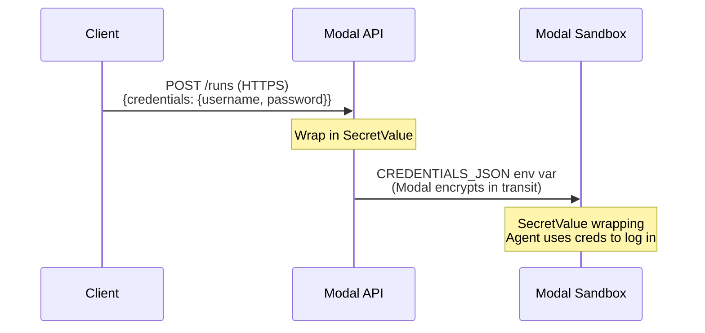

# Authentication & Credential Security

## Dashboard Authentication

CUA handles dashboard login with session persistence:

```bash
python scripts/run_local.py \
  --directive "..." \
  --playbook my_flow \
  --credentials '{"email": "admin@company.com", "password": "secret"}'
```

The auth system:
1. Tries restoring a previously saved session (cookies/localStorage)
2. If expired, logs in by detecting common form patterns (email/username + password fields)
3. Saves the new session for future runs

Sessions are stored at `~/.cua/sessions/` and reused across runs.

## Credential Security

Credentials are passed as a flat JSON dict (`{"username": "...", "password": "..."}`) over HTTPS. On the server, values are immediately wrapped in `SecretValue` to prevent accidental exposure.

### Protection at Each Layer

| Layer | Protection |
|---|---|
| Client to API | HTTPS (Modal enforces TLS) |
| API to sandbox | Modal encrypts sandbox env vars |
| In server memory | `SecretValue` — `str()` / `repr()` return `******`, `json.dumps()` raises `TypeError` |
| In logs | `SecretValue` blocks accidental logging of raw values |
| At rest | Credentials are never persisted to disk |

### Via the API

```bash
curl -X POST https://<workspace>--cua-serve.modal.run/runs \
  -H "Authorization: Bearer your-secret-api-key" \
  -d '{
    "directive": "Log into GitHub and check notifications",
    "credentials": {"username": "bot", "password": "ghp_abc123"}
  }'
```

### Via the CLI (Local Development)

```bash
python scripts/run_local.py \
  --directive "Log into the admin panel" \
  --credentials '{"username": "admin", "password": "secret"}'
```

### Flow


