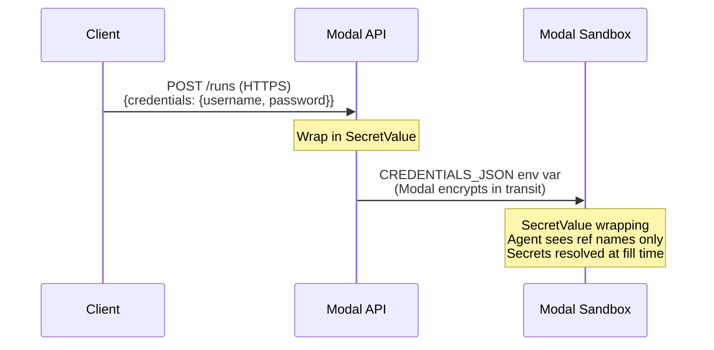

# Authentication & Credential Security

## Dashboard Authentication

CUA handles dashboard login automatically:

```bash
python scripts/run_local.py \
  --directive "..." \
  --playbook my_flow \
  --credentials '{"email": "admin@company.com", "password": "secret"}'
```

The auth system detects common login form patterns (email/username + password fields) and performs a fresh login each run. Credentials are resolved at fill time via `credential_ref` so secrets never appear in the LLM prompt.

## Credential Security

Credentials are passed as a flat JSON dict (`{"username": "...", "password": "..."}`) over HTTPS. On the server, values are immediately wrapped in `SecretValue` to prevent accidental exposure.

### Credential Refs

CUA keeps run-supplied credentials out of the LLM prompt. When credentials are provided via the structured `credentials` input, the agent only sees the available reference names (e.g., `email`, `password`), and the real secret is resolved immediately before the browser form fill at execution time.

What this protects:

- Plaintext credentials are not injected into the system prompt
- Action logs record `credential_ref` names such as `email` or `password`, not the resolved value
- Browser action validation and summaries operate on the reference name, not the secret text

What this does **not** protect:

- If you put secrets directly in the `directive`, they are still sent to the LLM and may appear in logs or telemetry
- `--credentials '{...}'` still exposes secrets to your local shell history and process arguments

Use this pattern:

```bash
python scripts/run_local.py \
  --directive "Go to the dashboard, log in with the provided credentials, and find the latest order" \
  --credentials '{"username": "admin", "password": "secret"}'
```

Do **not** put secrets in the directive:

```bash
# BAD — secrets visible to the LLM and in logs
python scripts/run_local.py \
  --directive "Go to the dashboard, use admin for username and secret for password, ..."
```

### Protection at Each Layer

| Layer | Protection |
|---|---|
| Client to API | HTTPS (Modal enforces TLS) |
| API to sandbox | Modal encrypts sandbox env vars |
| In server memory | `SecretValue` — `str()` / `repr()` return `******`, `json.dumps()` raises `TypeError` |
| In LLM prompt | Only reference names are visible, not secret values |
| In logs | Action logs record `credential_ref` names, not resolved values |
| At rest | Credentials are never persisted to disk |

### Via the API

```bash
curl -X POST https://<workspace>--cua-serve.modal.run/runs \
  -H "Authorization: Bearer your-secret-api-key" \
  -d '{
    "directive": "Log into GitHub and check notifications",
    "credentials": {"username": "bot", "password": "ghp_abc123"}
  }'
```

### Via the CLI (Local Development)

```bash
python scripts/run_local.py \
  --directive "Log into the admin panel" \
  --credentials '{"username": "admin", "password": "secret"}'
```

### Flow


