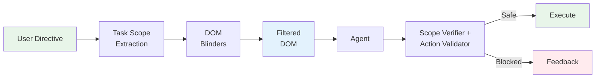

# Guardrails

CUA uses a layered safety architecture combining proactive observation control with runtime checks. Playbook execution bypasses most of these (pre-approved flows), but the LLM fallback path enforces all layers.

## Cognitive Blinders

The primary safety mechanism is **Cognitive Blinders** — a proactive observation filtering system that controls what the agent can see, rather than reactively blocking what it tries to do.

**The core insight**: if the agent can't see a "delete account" button, it can't click it. If it can't see injected instructions in a sidebar ad, it can't follow them.



### How It Works

**1. Task Scope Extraction** — Before the agent sees any web content, the directive is classified into a goal type that determines what the agent can see and do.

| Goal Type | Forms | Dangerous Buttons | Account Controls | `key_press` | `execute_sequence` |
|---|---|---|---|---|---|
| `read` | Hidden | Hidden | Hidden | Blocked | Blocked |
| `navigate` | Hidden | Hidden | Hidden | Blocked | Blocked |
| `interact` | Visible | Visible | Hidden | Allowed | Allowed |
| `fill_form` | Visible | Visible | Visible | Allowed | Allowed |

**2. DOM Blinders** — The DOM snapshot sent to the agent is filtered at two levels:

| Level | Where | What it does |
|---|---|---|
| **JS-side** | `dom_snapshot.js` in browser | Filters elements by category (forms, action buttons, account controls) based on task scope. Elements are removed before they leave the browser. |
| **Python-side** | `blinders/filters.py` | Scans for prompt injection patterns (`"ignore previous instructions"`, `SYSTEM:`, `[INST]` tokens) and redacts them. Wraps content with provenance markers (`[web-content-start/end]`). |

**3. Scope Verifier + Action Validator** — Multi-layer pre-execution check:

| Layer | Speed | What it checks |
|---|---|---|
| **Deterministic** | ~25us | Action type allowed for goal? Domain in scope? SSRF? Navigation limit? |
| **Regex fast-path** | ~5us | Is this a known-safe selector (navigation, menus, filters)? |
| **Action Validator (Haiku)** | ~500ms | Is this action aligned with the user's task? Should a potentially destructive click proceed? (LLM fallback path only) |

**4. Tool Schema Restriction** — The tool definition sent to Claude only includes actions allowed by the task scope. For a `read` task, `key_press` and `execute_sequence` are absent from the schema — the model cannot select them.

## Runtime Guardrails

Defense-in-depth checks that run alongside Cognitive Blinders. Configurable per-playbook via the `guardrails` section in YAML:

| Guard | Default | Configurable |
|---|---|---|
| Domain blocklist | Banking, government, email, payment, social media | `allowed_domains` / `blocked_domains` |
| Destructive action handling | Task-alignment and click safety are decided in the LLM validation path when enabled; deterministic scope/domain checks still apply regardless | `enable_llm_action_check` |
| SSRF protection | Private IPs blocked (override per-playbook) | `allow_private_networks` |
| URL visit limit | 50 unique URLs per run | `max_urls_visited` |
| Consecutive error limit | 5 errors | `max_consecutive_errors` |
| CAPTCHA handling | Auto-detect + type-specific timeouts (Cloudflare 30s, reCAPTCHA 5s) | Skipped for dashboard goal type |

Notes:

- The default offline test suite does not make live LLM calls; it exercises degraded and deterministic paths only.
- In real agent runs, `enable_llm_action_check=true` lets the model decide whether an ambiguous click is aligned with the task.
- Playbook execution remains deterministic; the LLM safety path is relevant for ad hoc agent runs and LLM handoff flows.

## Configuration

Set per-playbook in the YAML `guardrails` section:

```yaml
guardrails:
  allow_private_networks: true          # Allow localhost/internal IPs
  enable_llm_action_check: false        # Skip Haiku safety check for pre-approved flows
  max_urls_visited: 200                 # URL navigation limit
  max_consecutive_errors: 10            # Error limit before aborting
  allowed_domains: ["*.internal.com"]   # Domain allowlist (optional)
```

When omitted, safe defaults apply (private networks blocked, LLM checks enabled, standard limits).
